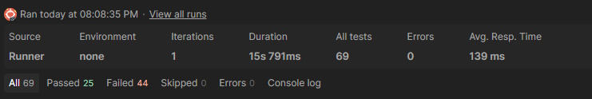

# Restful Booker — тестирование REST API

Проект по функциональному тестированию публичного API [Restful Booker](https://restful-booker.herokuapp.com/apidoc/index.html).

Покрыты все операции из документации, применены техники тест-дизайна, проверки автоматизированы в Postman. По результатам тестирования задокументировано 9 баг-репортов.

📄 **[Баг-репорты](bugs.md)**

---

## Результаты

| Метрика | Значение |
|---|---|
| Операций API покрыто | 8 из 8 |
| Запросов в коллекции | 69 |
| Найдено дефектов | 9 |
| Время полного прогона | ~16 секунд |

## Найденные дефекты

| ID | Заголовок | Эндпоинт |
|----|-----------|----------|
| [AUTH-1-BUG](docs/BUGS.md#auth-1-bug) | Авторизация с верными данными не проходит | `POST /auth` |
| [BOOKING-6-BUG](docs/BUGS.md#booking-6-bug) | Ответ `500 Internal Server Error` при невалидном формате даты в query-параметре | `GET /booking` |
| [BOOKING-13-BUG](docs/BUGS.md#booking-13-bug) | Ответ `500 Internal Server Error` при создании данных бронирования с неполными данными | `POST /booking` |
| [BOOKING-14-BUG](docs/BUGS.md#booking-14-bug) | Ответ `200 OK` при создании данных бронирования с логически неверными параметрами `checkin` и `checkout` | `POST /booking`, `PUT /booking{id}`, `PATCH /booking{id}` |
| [BOOKING-20-BUG](docs/BUGS.md#booking-20-bug) | Неверный код ответа `405 Method Not Allowed` при обновлении или удалении данных бронирования несуществующего идентификатора | `PUT /booking{id}`, `PATCH /booking{id}`, `DELETE /booking{id}` |
| [BOOKING-30-BUG](docs/BUGS.md#booking-30-bug) | Неверный код ответа `201 Created` при удалении данных бронирования | `DELETE /booking{id}` |
| [BOOKING-33-BUG](docs/BUGS.md#booking-33-bug) | Фильтр данных бронирования по параметру `checkin` не возвращает созданный объект данных | `GET /booking` |
| [BOOKING-34-1-BUG](docs/BUGS.md#booking-34-1-bug) | Ответ `500 Internal Server Error` при передаче числа в поле `firstname` или `lastname` | `POST /booking`, `PATCH /booking{id}` |
| [BOOKING-34-2-BUG](docs/BUGS.md#booking-34-2-bug) | Отсутствует валидация тела запроса при создании или обновлении данных бронирования | `POST /booking`, `PUT /booking/{id}`, `PATCH /booking/{id}` |

Полные баг-репорты с предусловиями, шагами воспроизведения и ожидаемым результатом — в [bugs.md](bugs.md).

---

## Что покрыто

**Операции:** `POST /auth`, `GET /booking`, `GET /booking/:id`, `POST /booking`, `PUT /booking/:id`, `PATCH /booking/:id`, `DELETE /booking/:id`, `GET /ping`

## Как запустить

Импортировать коллекцию [Postman](RestfulBooker-Tests.postman_collection.json), запустить через действие Run.

---

## Почему часть тестов падает

**Падающие проверки — это найденные дефекты, а не сломанные тесты.**

Каждое падение в отчёте соответствует записи в [docs/BUGS.md](docs/BUGS.md). Тесты намеренно проверяют поведение, соответствующее спецификации, а не фактическое поведение API — иначе дефекты остались бы незамеченными.

---
